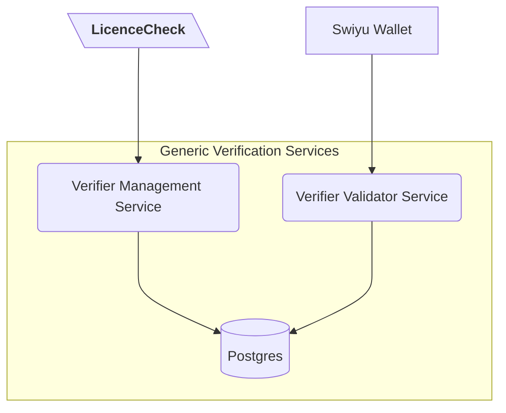

<!--
SPDX-FileCopyrightText: 2025 Swiss Confederation

SPDX-License-Identifier: MIT
-->

# LicenceCheck

## Overview

This is an official Swiss Government project developed by the [Federal Office of Information Technology, Systems and Telecommunication (FOITT)](https://www.bit.admin.ch/) as part of the electronic identity (E-ID) initiative.

The project is a **pilot application** that utilizes the Swiss E-ID infrastructure, specifically the **Generic Verification Services** (Generic Verifier Validator Service & Generic Verifier Management Service), to verify a learning driver's license. It is a **public-facing** application that does **not store any data**.

This repository is part of the broader ecosystem being developed for the future official Swiss E-ID. Our goal is to **engage with the community** and foster collaboration on building a secure, interoperable ecosystem for E-ID and other digital credentials.

For more information about the project, please visit the [introduction to the public beta open-source initiative](https://github.com/e-id-admin/eidch-public-beta).

## Table of Contents
    
- [Overview](#overview)
- [Installation and Building](#installation-and-building)
- [How to use](#how-to-use)
- [Contributions and feedback](#contributions-and-feedback)
- [License](#license)

## Overview

## Installation and Building

### Prerequisites

| Technology | Required Version |
|------------|------------------|
| Java       | >= 17            |
| node       | >= 20            |
| npm        | >= 10            |
| mvn        | >= 3.9.3         |

### Usage Instructions

> [!IMPORTANT]
> Due to security reasons, all secrets and files containing secrets have been removed from the project. It is still
> possible to test it locally with mocked data.

### Building the application

To run the application, you need to:

1. Run `mvn clean install` in root folder
2. Run `java -jar -Dspring.profiles.active=local ./vz-licencecheck-service/target/vz-licencecheck-service.jar`

## How to use

When the server has finished starting, it is possible to access the following addresses:

| Application  | Link                                  |
|:-------------|:--------------------------------------|
| LicenceCheck | http://localhost:8888/                |
| SwaggerUI    | http://localhost:8888/swagger-ui.html |

The backend has mock implementations to enable local usage.
If a new verification process is started, there will always be successful verification because the underlying infrastructure has
been mocked. To change the mock response, the [application-local.yml](vz-licencecheck-service/src/main/resources/application-local.yml)
file can be modified at line 5 or 6 to get different responses. 
If you want a successful verification, set `failResponse: false`, otherwise set `failResponse: true`. 
To test various error codes, set the expected error code in line 6. See all possible error codes in [ErrorCodeDto.java](vz-licencecheck-service/src/main/java/ch/admin/astra/vz/lc/domain/vam/model/ErrorCodeDto.java).  

## Contributions and feedback

We welcome any feedback on the code regarding both the implementation and security aspects. Please follow the guidelines for contributing found in [CONTRIBUTING.md](./CONTRIBUTING.md).

## License

This project is licensed under the terms of the MIT license. See the [LICENSE](LICENSE) file for details.